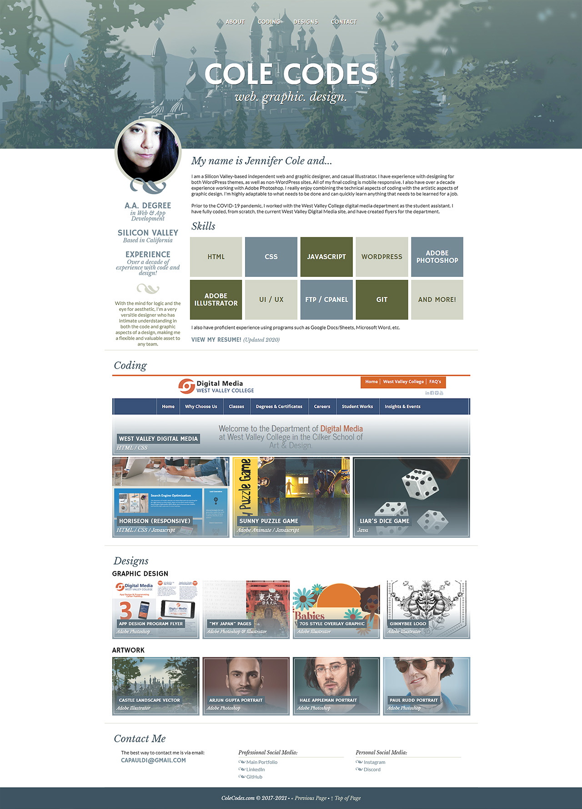

# Professional Portfolio CSS Challenge
Tasked with creating a portfolio using advanced CSS, this page was designed around a vector piece I did of a fantasy castle and features work I have done, both coded and graphical.\
Given that the assignment focused around CSS, instead of using Javascript on the lightbox, as I have coded in the past, I created one using pure CSS. Other CSS implemented in this layout includes flexbox, hovers, transitions, transforms, gradients, media queries, and more.\
The site title "Cole Codes" refers to my current portfolio website, [ColeCodes.com](https://colecodes.com/), on which I plan to implement a Wordpress theme version of this portfolio design in the future.

# View Live Page
[View the live CSS portfolio page on GitHub.](https://jcolecodes.github.io/portfolio-challenge-02/)

# Screenshot
